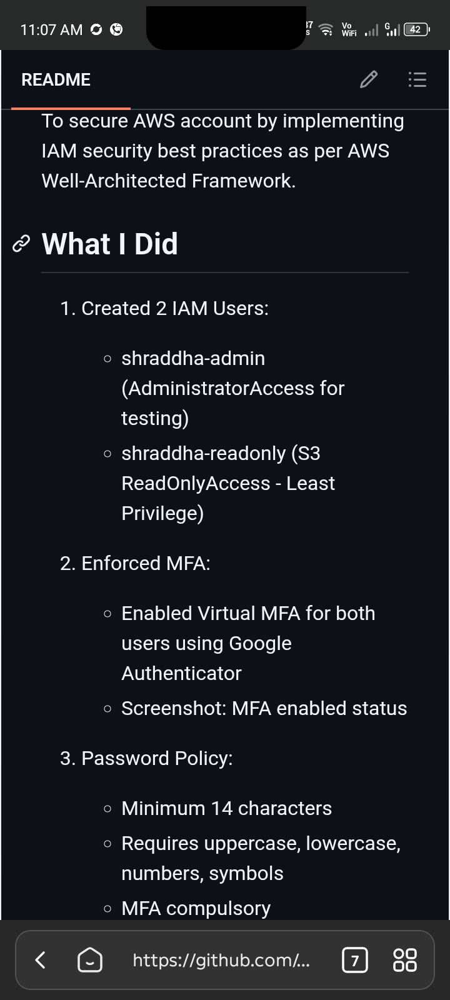

# AWS-IAM-Security-Audit
To secure AWS account by implementing IAM security best practices.

### What I Did
1. Created 2 IAM Users:
   - shraddha-admin (AdministratorAccess for testing)
   - shraddha-readonly (S3 ReadOnlyAccess - Least Privilege)
2. Enforced MFA for both users

### Proof

